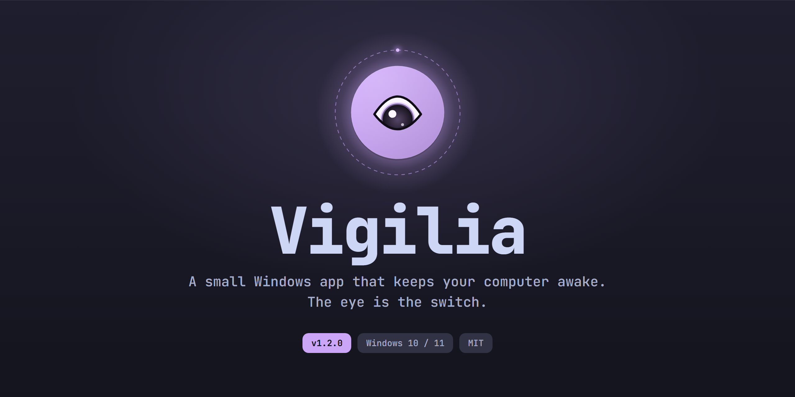

<p align="center"></p>

Маленькое приложение для Windows, которое не даёт компьютеру уснуть. Главная кнопка — глаз: закрыт — обычный сон, открыт — компьютер бодрствует. Интерфейс на русском и английском.


## Возможности

- **Вкл/выкл** кликом по глазу, пробелом или глобальной клавишей (по умолчанию **Ctrl+Alt+V**, можно назначить свою; работает, даже когда окно спрятано). Используется Windows Power Request API с причиной «Vigilia: режим «не спать» включён» (её показывает `powercfg /requests`, команде нужны права администратора). Если процесс завершится, Windows снимет запрос сама.
- **Настройки скрыты** за кнопкой «Настройки» внизу окна: по нажатию из неё «вырастает» панель с разделами «Режим», «Расписание», «Общие», «Система».
- **Экран:** «Может гаснуть» (не спит только система) или «Не гаснет» (система и дисплей).
- **До каких пор:**
  - **всегда** — пока не выключишь;
  - **таймер** — 30 минут, 1, 2 или 4 часа, с кольцом прогресса вокруг кнопки;
  - **процесс** — пока работает хотя бы одна из выбранных программ (до 10: игра, рендер, установка). Программы выбираются из списка запущенных с поиском и сравниваются по пути к exe, поэтому одноимённые программы из разных папок не путаются;
  - **загрузка** — пока скорость не опустится ниже порога (50 КБ/с – 1 МБ/с) на 2 минуты подряд. Считаются все физические адаптеры или один выбранный (например, VPN).
- **Расписание:** дни недели и интервал «с — до» с шагом 30 минут, в том числе через полночь. Если выключить режим вручную во время интервала, текущий интервал пропускается, а следующий сработает как обычно. Пока режим выключен, под глазом видно, когда начнётся ближайший интервал.
- **Уведомления Windows**, когда режим выключился сам (таймер, процесс, загрузка, конец расписания) или его переключили горячей клавишей, а окно при этом спрятано.
- **Трей:** × и Esc прячут окно, режим продолжает работать. Иконка в трее — в цвете интерфейса. Левый клик по иконке открывает или прячет окно, правый — меню «Включить/Выключить · Показать окно · Выход».
- **Общие:** цвет интерфейса (6 вариантов, тёмные слои подстраиваются под акцент), язык RU/EN (по умолчанию — язык системы), звуки.
- **Система:** горячая клавиша (клик по клавишам — запись нового сочетания), запуск с Windows, обновления.
- **Обновления:** проверка на GitHub Releases при старте и раз в 12 часов (можно выключить). Чтобы обновиться, кнопку нужно удерживать: Vigilia скачает установщик, сверит размер и SHA-256, закроется, а установщик поставит новую версию и запустит её. Портативная копия вместо этого открывает страницу релиза.
- Запоминает настройки. Режим «всегда» восстанавливается после перезапуска. Если приложение переместили или переустановили, путь автозапуска обновится сам.
- Работает только одна копия: повторный запуск показывает уже открытое окно.
- Учитывает настройку Windows «Эффекты анимации»: если она выключена, остаются только смены цвета, плавные проявления и вспышка.
- **Управление с клавиатуры:**
  - Tab — по одному переходу на каждый переключатель;
  - ←/→ и Home/End меняют значение внутри переключателя;
  - пробел и Enter нажимают;
  - кнопку обновления можно удерживать пробелом или Enter;
  - Esc по очереди закрывает список процессов или адаптеров, затем панель, затем прячет окно.

Дизайн: Catppuccin Mocha с подтоном акцента, моноширинный шрифт, «тройной отклик» на клик, переключатель-«гусеница», OutBack-пружинки. Звуки синтезируются в приложении.

## Установка

Скачай `Vigilia-<версия>-setup.exe` со страницы [Releases](https://github.com/alexskvo10/vigilia/releases). Установщик:
- ставит приложение для текущего пользователя, права администратора не нужны;
- создаёт ярлык в меню «Пуск»;
- по желанию включает автозапуск;
- при удалении убирает автозапуск.

Файлы не подписаны, поэтому при первом запуске Windows SmartScreen может показать предупреждение: «Подробнее» → «Выполнить в любом случае».

## Сборка

Нужны Flutter (проверено на 3.41.7) и Visual Studio с «Desktop development with C++».

```bash
flutter pub get
flutter test
flutter build windows --release
```

Результат: `build/windows/x64/runner/Release/` (запускать `vigilia.exe` вместе со всей папкой).

Тесты нативной части (трей, горячая клавиша) собираются после Release-сборки через CMake из Visual Studio:

```bash
cmake -S windows/runner/test -B build/native_test
```
```bash
cmake --build build/native_test --config Release
```
```bash
ctest --test-dir build/native_test -C Release --output-on-failure
```

Установщик собирается [Inno Setup 6](https://jrsoftware.org/isinfo.php) после Release-сборки:

```bash
iscc installer/vigilia.iss
```

Результат — `build/installer/Vigilia-<версия>-setup.exe`. В GitHub Actions ([build.yml](.github/workflows/build.yml)) анализ, тесты Dart и C++ и сборка идут на каждый пуш в `main`. Установщик собирается при ручном запуске workflow, а на тегах `v*` ещё и прикрепляется к релизу.

Иконки трея для всех цветов генерируются скриптом (нужен Pillow); с `--app` — ещё и иконка приложения:

```bash
python tool/make_icons.py
```

## Где что лежит

| Файл | Что делает |
|---|---|
| `lib/main.dart` | запуск: окно, контроллер, трей |
| `lib/controller.dart` | состояние и логика: вкл/выкл, экран, «до каких пор», расписание, настройки |
| `lib/schedule.dart` | окна расписания |
| `lib/probes.dart` | «какие программы запущены», адаптеры и скорость загрузки |
| `lib/win32.dart` | WinAPI через `dart:ffi`: запрос питания, звук, процессы и их пути, счётчики адаптеров (`GetIfTable2`), «эффекты анимации» |
| `lib/hotkey.dart` | сочетание глобальной клавиши |
| `lib/updater.dart` | проверка и установка обновлений |
| `lib/native.dart` | канал к нативной части: трей, уведомления, горячая клавиша |
| `lib/strings.dart` | тексты RU/EN |
| `lib/sounds.dart` | синтез звуков в WAV |
| `lib/settings.dart` | `%APPDATA%\Vigilia\settings.json`, автозапуск (`HKCU\...\Run`) |
| `lib/shell.dart` | трей, окно, уведомления |
| `lib/theme.dart` | палитра из акцента, длительности, кривые, `lighter`/`darker` |
| `lib/ui/` | экран и компоненты: орб, панель и разделы настроек, переключатели, toggle, запись сочетания, кнопка удержания, анимации текста |
| `windows/runner/native_shell.cpp` | трей, меню, уведомления, `RegisterHotKey` |
| `windows/runner/main.cpp` | одна копия приложения |
| `windows/runner/test/` | тесты нативной части |
| `installer/vigilia.iss` | установщик |

## Ограничения

- Режим не даёт уснуть только от бездействия. Закрытие крышки ноутбука, кнопка питания и «Пуск → Спящий режим» работают как обычно: так устроен Power Request API.
- Режим «загрузка» видит весь входящий трафик адаптера, а не одну загрузку: фоновые обновления тоже продлевают режим.
- Если сочетание уже занято другой программой, переключатель клавиши покажет это и останется выключенным.
- Для глобальной клавиши подходят буквы, цифры, F1–F24, стрелки, Home/End, PgUp/PgDn, Ins/Del, пробел и Pause вместе с Ctrl, Alt или Win.
- Файлы не подписаны: автообновление проверяет размер и SHA-256 из GitHub, но не подпись.

## Лицензия

[MIT](LICENSE)
