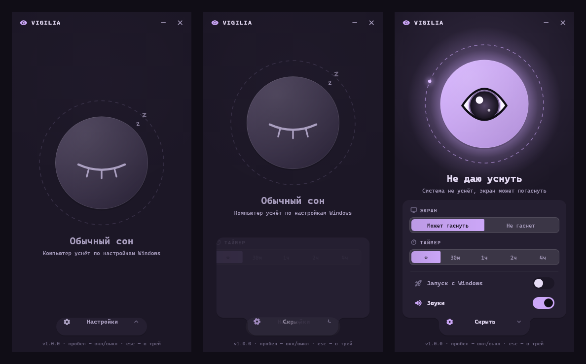

# Vigilia

Маленькое приложение для Windows, которое не даёт компьютеру уснуть. Одна большая кнопка-глаз: закрыт — обычный сон, открыт — компьютер бодрствует.



## Возможности

- **Вкл/выкл одним кликом** или пробелом. Используется Windows Power Request API с причиной «Vigilia: режим «не спать» включён» (её показывает `powercfg /requests`, команда требует прав администратора). Когда процесс завершается, Windows снимает запрос сама.
- **Настройки скрыты** за кнопкой «Настройки» внизу окна: по нажатию из неё «вырастает» панель, Esc закрывает её.
- **Экран:** «Может гаснуть» (не спит только система) или «Не гаснет» (система и дисплей).
- **Таймер:** ∞ / 30м / 1ч / 2ч / 4ч, кольцо прогресса вокруг кнопки; по истечении режим выключается сам.
- **Трей:** × и Esc прячут окно, а режим продолжает работать. Иконка трея показывает состояние. Левый клик открывает или прячет окно, правый — меню «Включить/Выключить · Показать окно · Выход».
- **Запуск с Windows** (стартует сразу в трей) и **звуки**, оба с переключателями.
- Запоминает настройки и включённое состояние. Если был включён таймер, состояние после перезапуска не восстанавливается.
- Работает только одна копия: повторный запуск показывает уже открытое окно.
- Учитывает настройку Windows «Эффекты анимации»: если она выключена, остаются только смены цвета, плавные проявления и вспышка.
- Управление с клавиатуры: Tab между контролами, ←/→ в переключателях, пробел или Enter нажимают.

Дизайн: Catppuccin Mocha с фиолетовым подтоном, моноширинный шрифт, «тройной отклик» на клик, переключатель-«гусеница», OutBack-пружинки. Звуки синтезируются в приложении.

## Сборка

Нужны Flutter (проверено на 3.41.7) и Visual Studio с «Desktop development with C++».

```bash
flutter pub get
flutter test
flutter build windows --release
```

Результат: `build/windows/x64/runner/Release/` (запускать `vigilia.exe` вместе со всей папкой).

Иконки генерируются скриптом (нужен Pillow):

```bash
python tool/make_icons.py
```

## Где что лежит

| Файл | Что делает |
|---|---|
| `lib/main.dart` | запуск: окно, контроллер, трей |
| `lib/controller.dart` | состояние и логика (вкл/выкл, экран, таймер, настройки) |
| `lib/win32.dart` | WinAPI через `dart:ffi`: запрос питания, звук, «эффекты анимации» |
| `lib/sounds.dart` | синтез звуков в WAV |
| `lib/settings.dart` | `%APPDATA%\Vigilia\settings.json`, автозапуск (`HKCU\...\Run`) |
| `lib/shell.dart` | трей и поведение окна |
| `lib/theme.dart` | цвета, длительности, кривые, `lighter`/`darker` |
| `lib/ui/` | экран и компоненты: орб, панель настроек, переключатели, toggle, анимации текста |
| `windows/runner/main.cpp` | одна копия приложения |

Настройки: `%APPDATA%\Vigilia\settings.json`. Автозапуск: значение `Vigilia` в `HKCU\Software\Microsoft\Windows\CurrentVersion\Run`.

## Ограничения

Режим предотвращает сон по таймауту бездействия. Закрытие крышки ноутбука, кнопка питания и «Пуск → Спящий режим» работают как обычно: так устроен Power Request API.

## Лицензия

[MIT](LICENSE)
